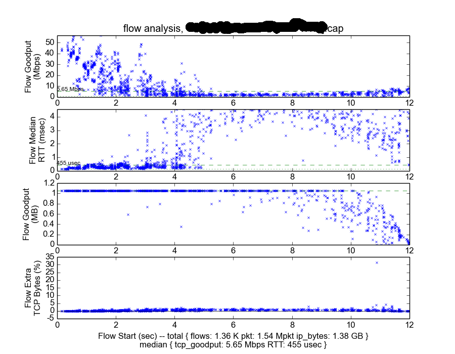
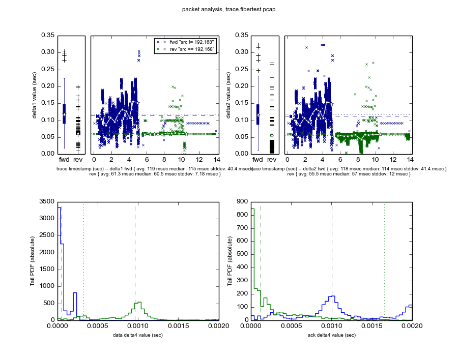

# rttcp: A Tool To Debug The Performance of a Network Link Using TCP

Copyright 2017 Google Inc.

This is not an official Google product.


# Introduction

rttcp is a tool to analyze the performance of a network link from a packet
trace containing TCP traffic.

The main use case is to provide some characterization of the performance
of a link using a tcp performance test (speedtest). Assume you have a
network whose performance you want to debug (e.g. it includes a radio
link). You get a client to access a speedtest service (e.g. the
[Google Fiber Speedtest](http://speedtest.googlefiber.net/). This is
very handy, as any device with a browser can do. You run your HTML
speedtest, and get some numbers. You also capture the trace at any
point in the path between your device and the speedtest server.

While measuring the performance of a connection by using tcp traffic
presents some issues (it depends on the exact parameters of tcp, like
congestion control, etc.), we can get an idea of how the link is
behaving by checking how the packets go back and forth.


# 1. Discussion

rttcp provides 2 analysis modes, namely "flow" and "packet".

1. the "flow" mode provides a per-flow performance analysis. In
particular, it provides 4 graphs:

    1. per-flow goodput rate as a function of the timestamp of the first
       packet in the flow. This is an important statistic, as it shows
       how the different flows have performed in the experiment. On the
       other hand, the exact performance depends on multiple factors (the
       RTT time, the number of losses, etc.), which makes the signal noisy.
    2. per-flow median packet RTT as a function of the timestamp of
       the first packet in the flow. This is the most interesting signal,
       as discussed in the [example analysis](./example.analysis.md).
    3. per-flow total goodput as a function of the timestamp of the first
       packet in the flow. This is a description of the test setup, for
       validation purposes.
    4. per-flow extra IP traffic as a function of the timestamp of the first
       packet in the flow. This is a rough validation that there have not
       been too many losses.


2. the "packet" mode provides an analysis of per-packet RTT data. We
measure a TCP segment RTT as the difference between the timestamp of
the TCP segment, and the timestamp of the first ACK packet that ACKs
the highest SEQ number of the TCP segment.

The idea is that the first ACK that acknowledges a full segment is
the first instant where we can be sure that the segment has been
received. We remove any duplicate data segments to avoid biasing the
statistics with the latency of lost packets.

This mode, in fact, measures the time for (a) the (data) segment to
reach the receiver, (b) the time for the receiver tcp stack to receive
it and generate an ACK, and (c) the time for the (pure) ACK to reach
the capturing point. This provides a nice measurement of the
round-trip time performance of the download path from the capturing
point.

In particular, the "packet" mode provides 4 graphs (also known as
"deltas"):

  1. delta1: delta1 is the RTT of every TCP segment in the trace, as a
  function of the timestamp of the TCP segment.
  2. delta2: delta2 is similar to delta1, but instead of using the ACK
  and SEQ numbers, it uses the TSval and TSecr of the
  [tcp timestamp option](http://www.ietf.org/rfc/rfc1323.txt).
  3. delta3: delta3 tries to calculate the one-way latency of traffic
  by estimating the offset and HZ of the sender.
  4. delta4: delta4 measures the inter-packet latency in tcp trains.
  It defines a train as a set of packets separated no more than a
  constant (we use 2 msec for this, as this is the `hystart_ack_delta`
  constant in `linux/net/ipv4/tcp_cubic.c`).


```
                      delta1/delta2         data segments
               /---------------------| - - - - - - - - - - - -\
              |                      |                         ^
    +---------|--+            +---------------+             +--|--------+
    | client +|  |------------| capture point |-------------|  | server |
    +--------||--|            +---------------+             +--|--------+
             ||                      |        pure ACKs        ^
              \\---------------------| - - - - - - - - - - - -/
               \-------------------->| - - - - - - - - - - - -/
                      delta3
```

Figure 1 shows a depiction of 3 of the 4 deltas in the forward case.
delta1 and delta2 both measure the time for a segment to go from the
capture point to the client and back. delta3 measures the time from
the client to the capture point.


As the data segments can flow in both directions, we provide for
separation of the forward and reverse paths, which are typically
different. We also provide a boxplot of the distribution of the
values, plus the basic statistics.


# 2. Operation

0. `rttcp.py` is a vanilla python file. It uses
[tshark](https://www.wireshark.org/docs/wsug_html_chunked/AppToolstshark.html)
(a CLI version of wireshark) to print some selected fields in the
packet trace. It then uses a combination of numpy, pandas, and matplotlib
to analyze and graph the results.

To get to know the options of the tool, run:

```shell
$ ./rttcp.py help
usage: rttcp.py [-h] [-d] [--quiet] [-v] [--tshark TSHARK] [-i INPUT-FILE]
                [-o OUTPUT-FILE] [--type ANALYSIS_TYPE]
                [--src-reverse SRC-REVERSE]
                {help,analyze,plot} ...

rttcp flow aggregator.

positional arguments:
  {help,analyze,plot}
    help                show help screen
    analyze             analyze pcap file
    plot                plot analysis file

optional arguments:
  -h, --help            show this help message and exit
  -d, --debug           Increase verbosity (use multiple times for more)
  --quiet               Zero verbosity
  -v, --version         show program's version number and exit
  --tshark TSHARK       tshark binary
  -i INPUT-FILE, --input INPUT-FILE
                        input file
  -o OUTPUT-FILE, --output OUTPUT-FILE
                        output file
  --type ANALYSIS_TYPE  set the analysis type (flow, packet)
  --src-reverse SRC-REVERSE
                        any packet from a src definition (cidr) as reverse
```


1. To run the "flow" analysis:

```shell
$ ./rttcp.py analyze --type "flow" -i trace.pcap -o trace.pcap.flow.txt
...
$ ./rttcp.py plot --type "flow" -i trace.pcap.flow.txt --title "flow analysis, trace.fibertest.pcap" --src-reverse 192.168 -o trace.fibertest.pcap.flow.png
# plotting /data/chema/proj/marconi-traces/loon/trace.fibertest.pcap.flow.txt
$ ./rttcp.py plot --type "flow" -i trace.pcap.flow.txt --title "flow analysis, trace.fibertest.pcap" --src-reverse 192.168 -o trace.fibertest.pcap.flow.pdf
```



Figure 2 shows an example of "flow" analysis result.


2. To run the "packet" analysis:

```shell
$ ./rttcp.py analyze --type "packet" -i trace.pcap -o trace.pcap.packet.txt
...
$ ./rttcp.py plot --type "packet" -i trace.pcap.packet.txt --title "packet analysis, trace.fibertest.pcap" --src-reverse 192.168 -o trace.fibertest.pcap.packet.png
```



Figure 3 shows an example of "packet" analysis result.


# 3. References

* [tcptrace](http://www.tcptrace.org/): rttcp is very similar to tcptrace,
but oriented to analyzing a trace composed of multiple connections,
instead of performing per-connection analysis.

